# 💞 DevTinder

A modern matchmaking platform for developers — **DevTinder** helps connect coders based on skills, interests, and goals. Built with **React**, **Redux**, **Tailwind CSS**, **DaisyUI** and **Vite**, the app delivers a smooth, responsive, and secure user experience.

🔗 **Live Demo:** [https://dev-tinder-kappa-seven.vercel.app](https://dev-tinder-kappa-seven.vercel.app)  
📁 **Frontend Repo:** [https://github.com/Aneesh-Khanna/DevTinderWeb](https://github.com/Aneesh-Khanna/DevTinderWeb)  
⚙️ **Backend Repo:** [https://github.com/Aneesh-Khanna/DevTinder](https://github.com/Aneesh-Khanna/DevTinder)

---

## 🧩 Microservice Architecture

DevTinder follows a **microservice architecture** that separates the frontend (React-based client) and backend (Node.js microservice) for scalability and independent deployment.

| Service     | Description                                                 | Tech Stack                                        |
| ----------- | ----------------------------------------------------------- | ------------------------------------------------- |
| 🖥️ Frontend | Handles UI, routing, API integration, chat interface        | React, Redux Toolkit, Tailwind CSS, Vite, DaisyUI |
| ⚙️ Backend  | Manages authentication, matchmaking, chat, and data storage | Node.js, Express, MongoDB, Socket.IO              |

Each service communicates securely through REST APIs and WebSockets.

---

## 🚀 Features

- 🔐 **JWT Authentication** (Login / Signup / Logout)
- ✅ **Verified Users** see a tick mark in the header
- 🚫 **Unverified Users** cannot log in
- 💬 **Real-time chat** powered by Socket.IO
- 🧩 **Validation** for sending messages — only friends can chat
- ⚠️ `socket.on("errorMsg")` listener to show toasts for backend errors
- 🔄 **Auto-scroll chat window** to latest messages
- 💾 **User Profile Editing** (edit all fields except password)
- 🔑 **Change Password Component** (with `/profile/password` API)
- 🎭 **Shimmer UI** for Feed, Requests, and Connections pages
- 🌐 **Fully Responsive** across devices
- 🧠 **.env Config** for both frontend and backend keys
- 🕒 **UptimeRobot** integration to keep backend always awake
- 🔔 Toast notifications for important actions
- 📄 Offline page with custom hook
- 🧼 Memoization to prevent redundant API calls

---

## 📸 Screenshots

### 🔐 Authentication

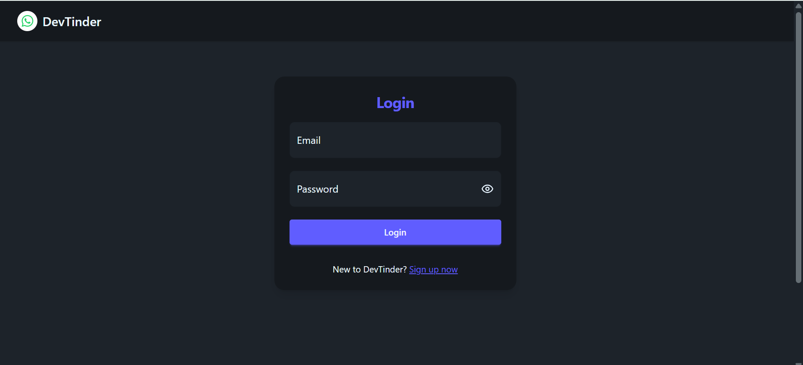
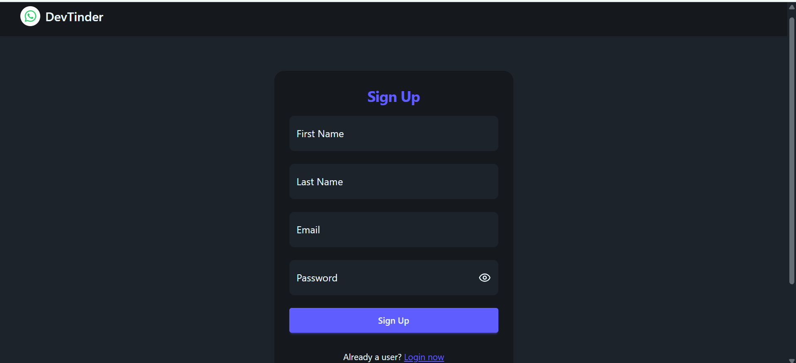
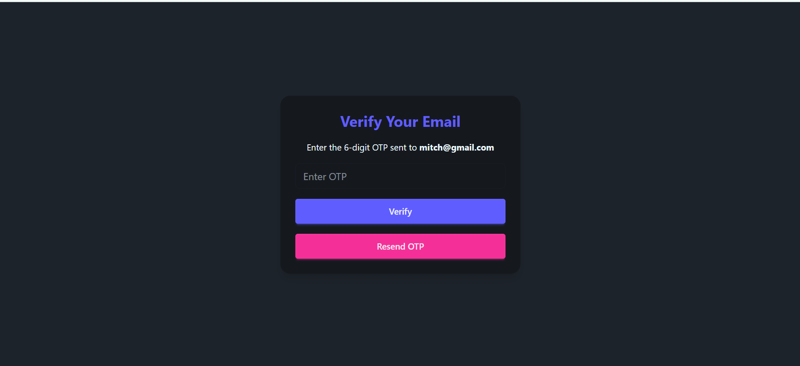

### 💞 Feed

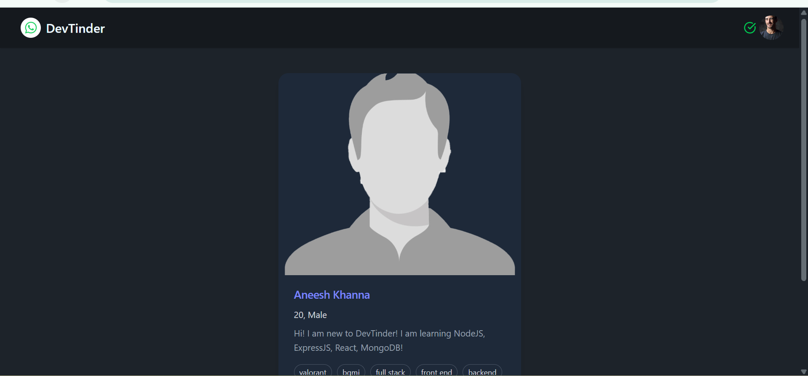
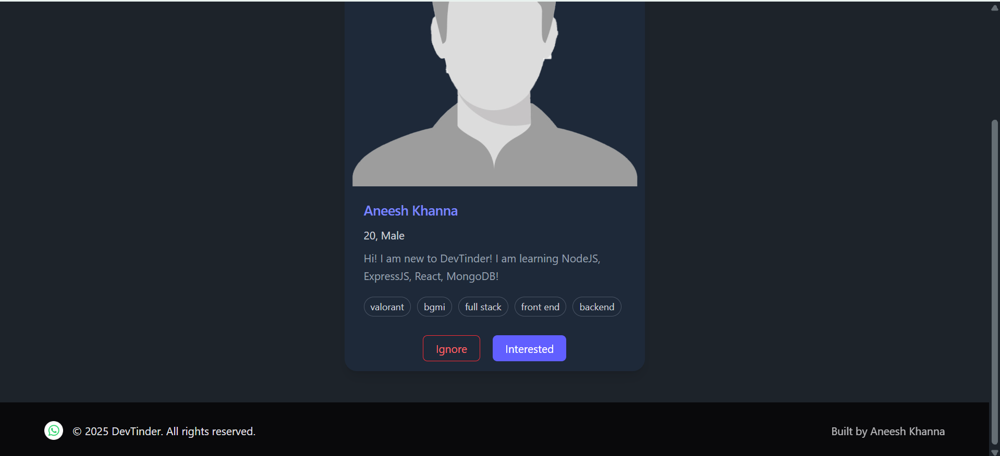
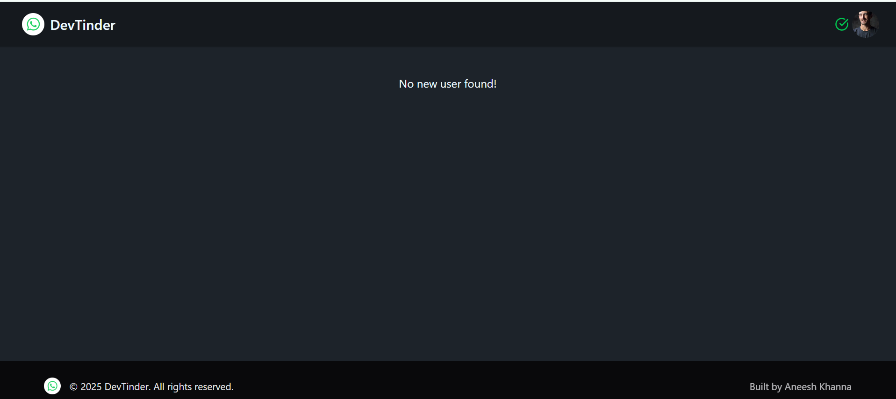

### ✨ Features

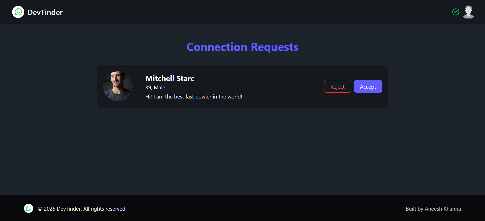
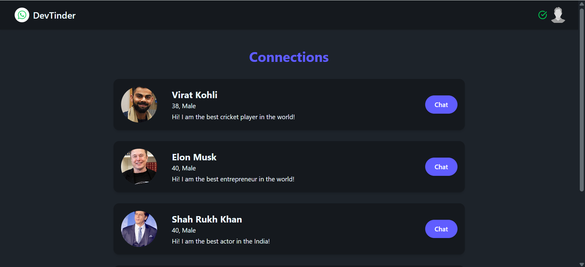
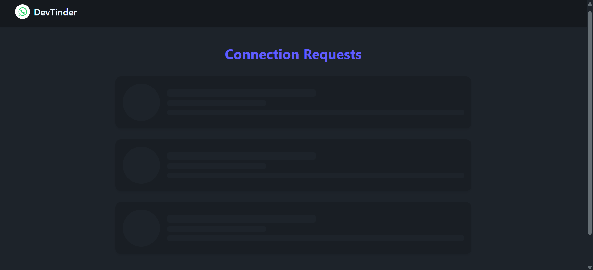
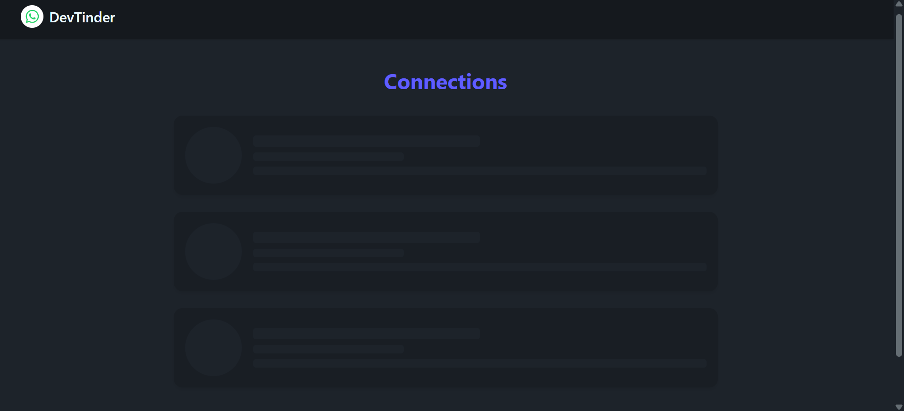

### ✏️ Profile Updation

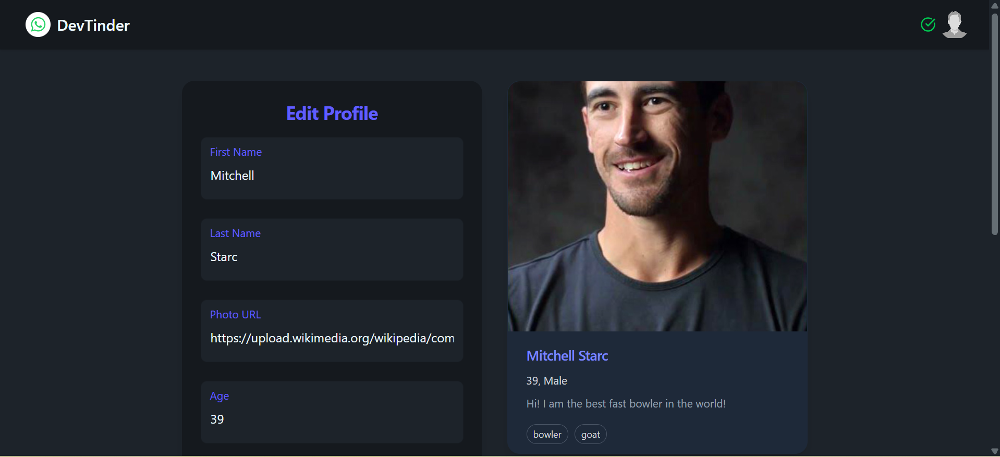
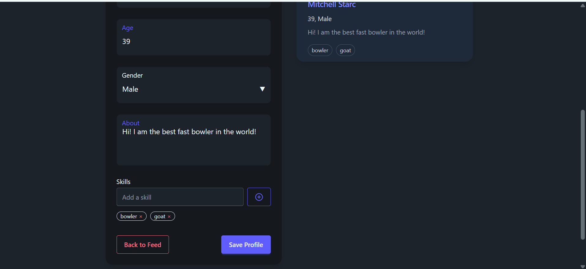
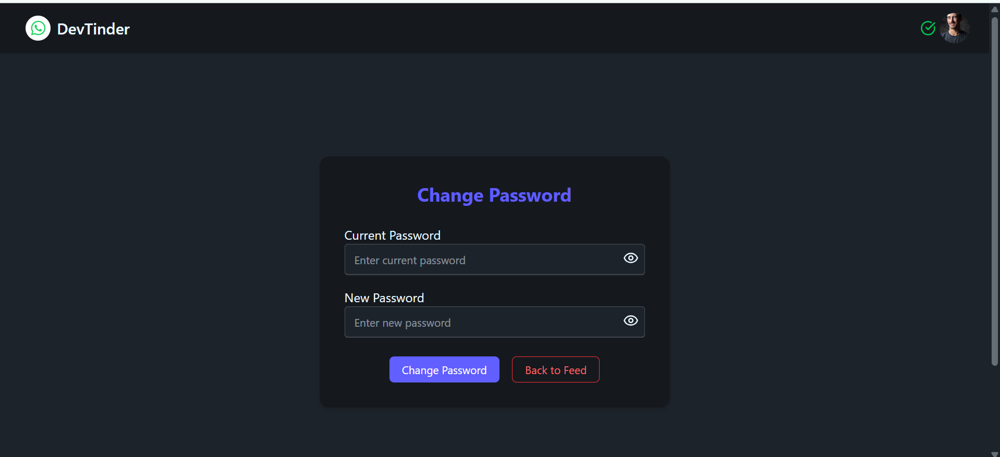

### 💬 Chat Window

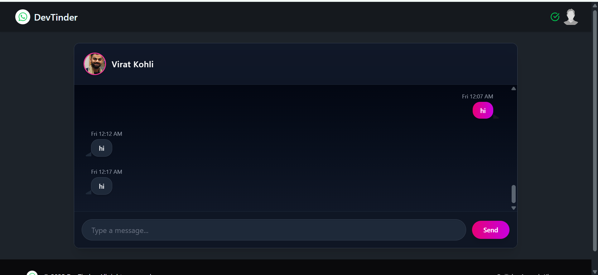

### 📄 Redux Store and Custom Offline Page

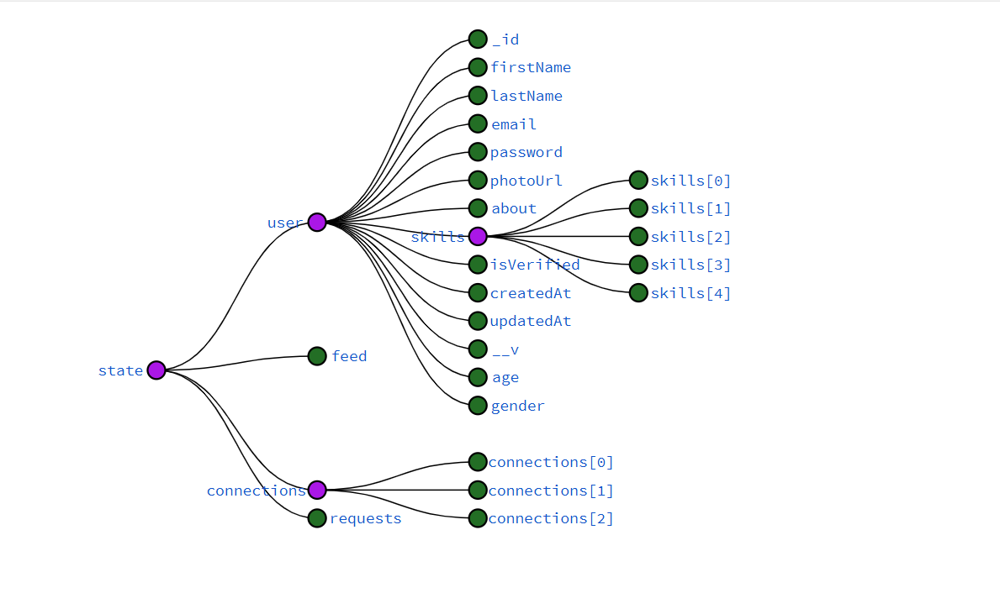


### 🧭 MongoDB

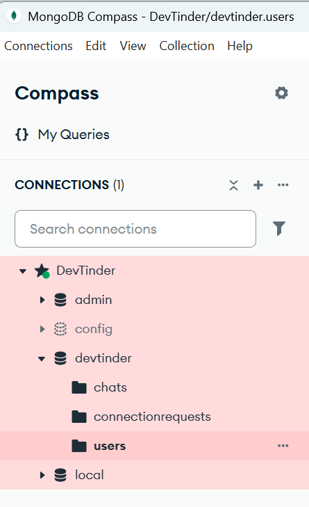

### 📮 Postman API's

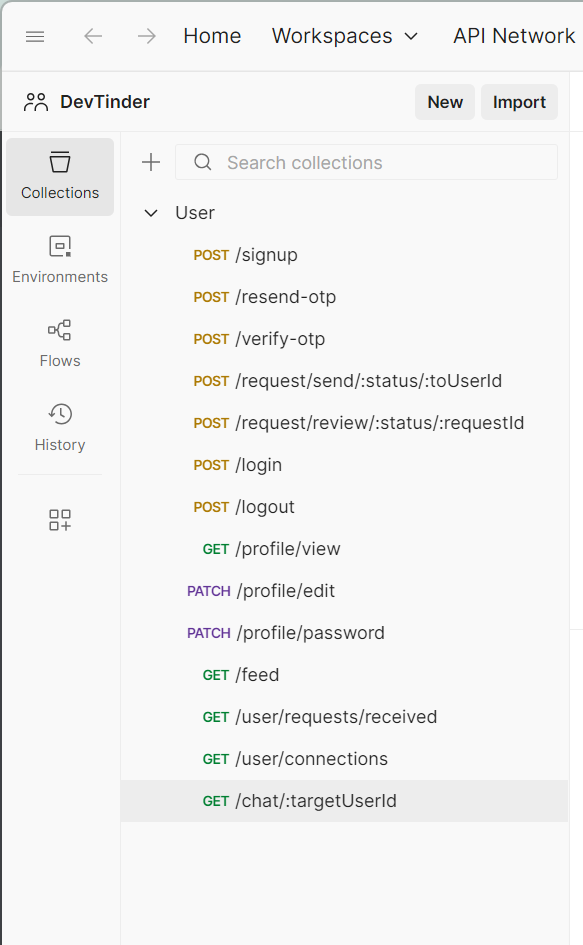

---

## 🧠 Architecture & Design Highlights

- **Routing:** Protected + Public routes with `react-router-dom`
- **State Management:** Redux Toolkit slices for user, chat, and matches
- **Validation:** Form + API-level validation on both client & server
- **Realtime Updates:** WebSockets for message sync
- **Responsive Design:** Tailwind breakpoints (`sm`, `md`, `lg`)
- **Error Handling:** Toast notifications + centralized interceptors
- **Shimmer UI:** For smoother loading transitions
- **Environment Management:** `.env` for URLs and tokens
- **Performance:** Memoized components + lazy loading

---

## 🛠️ Setup Instructions

```bash
# Clone repo
git clone https://github.com/Aneesh-Khanna/DevTinderWeb
cd DevTinderWeb

# Install dependencies
npm install

# Create environment file
touch .env
```

### ⚙️ .env Example

```bash
VITE_BACKEND_URL=your_backend_link
VITE_JWT_SECRET=your_secret_here
```

---

## 📁 Folder Structure

```bash
src/
├── components/
│   ├── Body.jsx
│   ├── CustomOfflinePage.jsx
│   ├── ChangePassword.jsx
│   ├── Chat.jsx
│   ├── Connections.jsx
│   ├── Header.jsx
│   ├── Login.jsx
│   ├── EditProfile.jsx
│   ├── Feed.jsx
│   ├── Footer.jsx
│   ├── Profile.jsx
│   ├── Requests.jsx
│   ├── UserCard.jsx
│   └── VerifyEmail.jsx

├── customHooks/
│   └── useOnlineStatus.jsx

├── utils/
│   ├── constants.js
│   ├── socket.js
│   ├── ReduxStore/
│   │   ├── appStore.js
│   │   ├── connectionSlice.js
│   │   ├── feedSlice.js
│   │   ├── requestSlice.js
│   │   └── userSlice.js
│   ├── ShimmerUI
│   │   ├── ConnectionsShimmer.jsx
│   │   └── RequestsShimmer.jsx
├── App.jsx
├── main.jsx
├── index.css

```

## 🧼 Best Practices Followed

- ✅ Token validation & protected routes
- ✅ Clean modular structure
- ✅ Responsive & accessible design
- ✅ Shimmer UI for better UX
- ✅ Secrets hidden via .env
- ✅ Verified user handling logic
- ✅ Proper error handling and socket validation

---

## 📬 Contact

Built with ❤️ by **Aneesh Khanna**  
⭐ Star the repo or contribute!  
📁 [Backend Repo →](https://github.com/Aneesh-Khanna/DevTinder)
